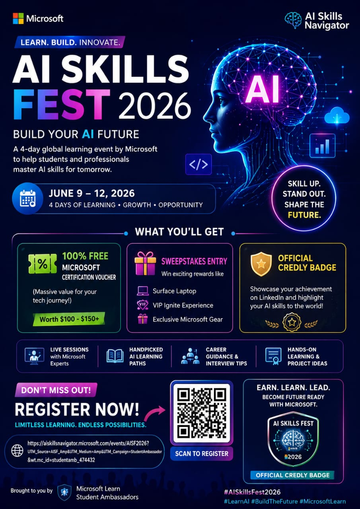

<div align="center">

# 🚀 Microsoft AI Skills Fest 2026

## 🎓 Free Certification Voucher + Digital Badge




</div>


# 📅 Event Timeline

| Event | Date |
|------|------|
| Starts | June 8, 2026 |
| Ends | June 12, 2026 |
| Badge Delivery | June 19, 2026 |
| Voucher Expiry | August 11, 2026 |

---

# 🎯 Rewards

✅ Free Microsoft Certification Voucher  
✅ Credly Digital Badge  
✅ AI Learning Resources  
✅ Certification Preparation  

---

# 🧠 Participation Checklist

- [ ] Register on AI Skills Navigator
- [ ] Select Playlist
- [ ] Complete Playlist
- [ ] Submit Voucher Form
- [ ] Receive Badge
- [ ] Redeem Voucher


# 📚 Recommended Certifications

| Certification | Level |
|--------------|------|
| AI-900 | Beginner |
| AI-102 | Advanced |
| DP-100 | Intermediate |


# 📌 Important Rules

⚠️ Playlist must NOT be modified  
⚠️ One reward per person  
⚠️ Voucher valid for 60 days only  

---

# 🌟 Repository Features

✨ AI Learning Roadmap  
✨ Exam Preparation Notes  
✨ Practice Resources  
✨ Community Contributions  


# 📂 Repository Structure

```bash
Microsoft-AI-Skills-Fest-2026/
│
├── assets/
├── docs/
├── checklist/
├── resources/
│
├── README.md
├── LICENSE
└── CONTRIBUTING.md
```


# 💙 Support

⭐ Star this repository  
🍴 Fork this repository  
📢 Share with friends  


<div align="center">

# 🚀 Happy Learning!

</div>
